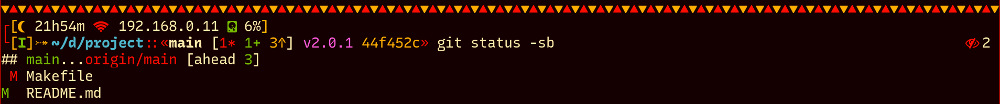
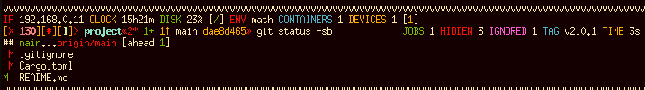
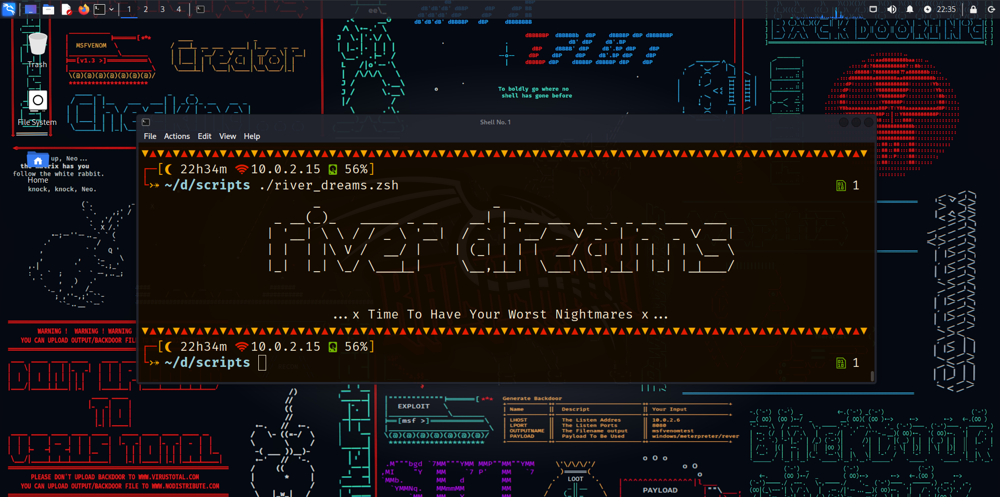

<h1 align="center">⛵ River Dreams 🌊</h1>

<div align="center">
  
</div>

<p align="center">A feature rich and async ZSH theme that developers have been <i>river dreaming</i> for a long time.</p>

## Preview






## What features does it have?

River Dreams was designed to help people that want to take their terminals to
another level and need to use it for programming and doing maintenance.
Everything that you will probably need will be at your glance even when you
do not have a proper modern terminal.

It contains ideas that I have created myself and others that I have got
from other popular ZSH themes, so you will probably find what you are looking
for on it.

Everything in it is a module:

| Module | Function | Position | Runtime |
| ------ | -------- | -------- | ------- |
| commands_separator  | Shows a separator between commands. | top | sync |
| clock               | Shows the current hours and minutes with an icon that changes depending of the hour of the day. | top | async
| local_ip_address    | Shows your local ip address. | top | async
| disk_usage          | Shows the disk usage percentage of the partition mounted at `/`. | top | async
| storage_devices     | Shows the quantity of external storage devices connected to the machine including a numeric indicator to show how many are actually mounted. | top | async
| docker_containers   | Shows the quantity of active Docker containers. | top | async
| python_environment  | Shows the sourced Python environment. | top | sync
| exit_code           | Shows the exit code of commands that throwed an error. | left | sync
| root                | Shows a decorator if you are root. | left | sync
| vi_mode             | Shows the vi mode if you are using the [`zsh-vi-mode`](https://github.com/jeffreytse/zsh-vi-mode) plugin. | left | sync
| directory           | Shows the current directory abbreviated, just like the `fish` shell. It will use an icon for some directories. | left | sync
| directory_ownership | Shows a decorator if you are not the owner of the current directory. | left | sync
| git                 | Shows branch, status with numeric indicators for changes, commits, pulls and pushes, latest tag and last commit hash | left | async
| jobs                | Shows the quantity of jobs running in the background. | right | sync
| executable_files    | Shows the quantity of executable files in the current directory. | right | async
| symbolic_links      | Shows the quantity of symbolic links in the current directory. | right | async
| hidden_files        | Shows the quantity of hidden directories/files in the current directory. | right | async
| ignored_files       | Shows the quantity of directories/files being ignored by `git`. | right | async
| elapsed_time        | Shows the elapsed time of the last command in minutes and seconds. | right | async

By default, River Dreams will also use fallback text if it detects that your
terminal emulator only supports the 4-bits color palette. This is a measure that
allows you to use all its capabilities even in old terminals, that probably
does not support UTF-8.

But, I know that sometimes this behavior will not work as intended. For those
cases, you can define the environment variable `RIVER_DREAMS_USE_FALLBACK_TEXT`:
if its value is `true`, it will use fallback text, otherwise, it will not.


## What about customization?

River Dreams is not customizable unless you modify its source code. You can
only change the colors it uses for the commands separator module
by defining the environment variable `RIVER_DREAMS_USE_COLOR_VARIANTS`:
if its value is `true`, it will use `blue` instead of `yellow`, otherwise,
it will keep the default.


## What about speed?

River Dreams uses [`zsh-async`](https://github.com/mafredri/zsh-async) to
perform slow tasks asynchronously in the background while you use the terminal.
This helps it keep a decent speed while you are doing your work.


## What about testing?

As I do not own a MacOS, I could only test it in Linux. If you own a MacOS,
it would be great if you post the issues you have found in that system. Maybe,
in the future, I found out a way of testing it in that system and solve them.


## What about the name?

Pará is a state that is well know about its rivers with a culture that is
heavily influenciated by it. And I am a person with dreams, so I though why
not to call it "River Dreams"?


## Installation/Uninstallation

Before installing the theme, you need to ensure that you have its required
dependencies installed:
  + the Noto Font family - this font has a variety of characters that can
    be used as a fallback by your terminal if your current font does not
    contains some symbols used in the theme.
  + a font patched by Nerd Fonts or only the Nerd Font symbols - this font will
    provide you the symbols used in the theme. You can download it in its
    official repository on GitHub.
  + `awk` or some variant - it will be used to parse commands.

Optionally, you can install these other dependencies to get more information
to show in the theme:
  + `git` - it will be used to provide Git information.
  + `docker` - it will be used to provide Docker information. Remember to
     activate its socket/daemon.
  + `ip` or `ipconfig` - it will be used to provide your local IP address.

If you are using Linux, you can probably download the dependencies using
your distribution's package manager.

If you are using MacOS, you can use [HomeBrew](https://brew.sh).

### Installing/Uninstalling With OhMyZSH
  + clone this repository to `${ZSH_CUSTOM}/themes` that is, by default, at
    `~/.oh-my-zsh/custom/themes`.

    ```bash
    git clone --depth 1 --recurse-submodules https://github.com/skippyr/river_dreams ${ZSH_CUSTOM:-~/.oh-my-zsh/custom}/themes/river_dreams
    ```
  + Set the variable `ZSH_THEME=river_dreams/river_dreams` in your `~/.zshrc`.
  + Refresh your ZSH by reopening your terminal emulator.

  If you want to uninstall it, use the following command:
  
  ```bash
  rm -rf ${ZSH_CUSTOM:-~/.oh-my-zsh/custom}/themes/river_dreams
  ```


### Installing/Uninstalling using antidote
To install, use:

```bash
antidote install skippyr/river_dreams
```

To uninstall, use:

```bash
antidote purge skippyr/river_dreams
```

### Installing/Uninstalling Manually
  + clone this repository to a separated directory, for example
    `~/.config/zsh/plugins/river_dreams`.

    ```bash
    git clone --depth 1 --recurse-submodules https://github.com/skippyr/river_dreams ~/.config/zsh/plugins/river_dreams
    ```
  + source the theme file `river_dreams.zsh-theme` that is inside the
    repository's directory in your `.zshrc`.

    ```bash
    source ~/.config/zsh/plugins/river_dreams/river_dreams.zsh-theme
    ```
  + Refresh your ZSH by reopening your terminal emulator.

  If you want to uninstall it, remove the directory you have cloned:

  ```bash
  rm -rf ~/.config/zsh/plugins/river_dreams
  ```

### Know Installation Issues

It has been detected that some Linux distributions that have their own default
configurations for `zsh` can result in River Dreams causing errors, but those
can be fixed if those default configurations are removed.

One example of distribution that caused this issue was `Kali Linux`.

## See Also

River Dreams is now part of the [`awesome-zsh-plugins`](https://github.com/unixorn/awesome-zsh-plugins)
repository. What about going there to find out more cool themes, frameworks and
plugins for ZSH?

Are you looking for a color scheme? I am proud to announce that
[`Tropical Paradise`](https://github.com/skippyr/tropical_paradise) has been
released with dark and light variants. What about checking it out?

## Issues, Enhancements And Questions

If you have found an issue while using this software or have an idea to
improve it, feel free to use the issues tab on its page on GitHub.

Questions can be made in the same way, but it would be better if you use
the Discussions tab instead.


## License

Copyright (c) 2023, Sherman Rofeman. MIT License.

