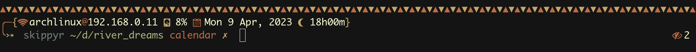
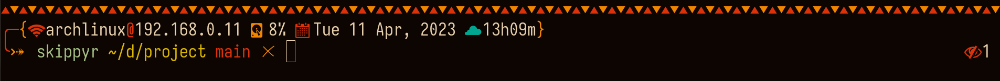
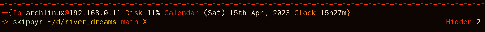

<h1>River Dreams</h1>
	<h2>Introduction</h2>
		
River Dreams is a fast multi line ZSH theme that is heavily inspired by the rich culture of Pará, a state of Brazil.

		
		
		
		
In the images, River Dreams was used on the <a href="https://github.com/kovidgoyal/kitty">Kitty</a> terminal with the <a href="https://github.com/skippyr/flamerial">Flamerial</a> color palette and <a href="https://fonts.google.com/specimen/Inconsolata">Inconsolata</a> font. Noto Fonts and Symbols Nerd Font were used as fallback fonts.

		
The philosophy behind River Dreams is to create a comfortable and professional environment for people that want to spend most of their time in the terminal, by grouping most of the information that you would normally find in a system's bar in it.

		
Like this, it reduces your need of a graphical environment and becomes a great addition for when you are using a window manager or can not have access to your graphical environment, like when doing a maintenance.

		
In your prompt, you will find:

		<ul>
			<li>your local IPv4 address and your host name in the network.</li>
			<li>the total disk usage percentage.</li>
			<li>the current week day abbreviated, day of month, month abbreviated and year.</li>
			<li>the current hours and minutes in 24h format.</li>
			<li>the exit code of failed commands.</li>
			<li>your current user.</li>
			<li>the sourced Python virtual environment base name.</li>
			<li>your current directory path abbreviated just like the <code>fish</code> shell does.</li>
			<li>a decorator if you are not the user owner of the current directory.</li>
			<li>the current git branch if you are in a directory being tracked by <code>git</code>.</li>
			<li>a decorator to help you find where you can type your commands.</li>
			<li>the quantity of background jobs.</li>
			<li>the quantity of hidden files in the current directory.</li>
			<li>the quantity of executable files in the current directory.</li>
			<li>the quantity of symbolic links in the current directory.</li>
		</ul>
		
River Dreams also contains fallback text, that can be used when you do not have access to a font that has the pretty symbols it uses. Learn how to enable and disable it in the Customization section.

	<h2>Installation</h2>
		
This section will teach everything you need to know to install River Dreams.

		
Be warned that River Dreams was only tested on Linux, as I do not own a MacOS. I can not ensure that it will work for that system, even thought there will be instructions for it too. If you had issues in that system, then please report them in the issues tab so I can know it and try to fix them in the future if I have an oportunity.

		<ul>
			<li>Install these dependencies:</li>
				<ul>
					<li><code>ZSH</code>. This is the shell this theme applies on.</li>
					<li><code>gcc</code> and standard C libraries. These are the compiler and libraries needed to compile the source codes.</li>
					<li><a href="https://fonts.google.com/noto/specimen/Noto+Sans">Noto Sans</a> and a font patched by <a href="https://github.com/ryanoasis/nerd-fonts">Nerd Fonts</a>. Those fonts provides the pretty symbols that are shown in the prompt. If you do want to install them, you can prefer to use River Dreams's fallback text.</li>
				</ul>
				
Most dependencies can be installed through package managers. If you are using Linux, refer to your distributions's package manager. If you are using MacOS, refer to <a href="https://brew.sh">HomeBrew</a>. Other dependencies can be installed from their specific websites: hyperlinks are available in the topics above.

				
If you are using a Debian based Linux distribution like Ubuntu or PopOS!, you can install most of the dependencies using <code>apt</code>:

				<pre><code>sudo apt install -y zsh build-essential fonts-noto-core</code></pre>
				
If you are using an Arch based Linux distribution, you can install most of the dependencies using <code>pacman</code>:

				<pre><code>sudo pacman -S --noconfirm --needed zsh base-devel noto-fonts</code></pre>
				
You would still need to install a font patched by Nerd Fonts manually if you want to.

			<li>Download this repository to a directory in your machine. If you have <code>git</code> installed, you can use it in the following command:</li>
			<pre><code>git clone --depth 1 https://github.com/skippyr/river_dreams ~/.config/zsh/themes/river_dreams</code></pre>
			
This command will clone this repository to the directory <code>~/.config/zsh/themes/river_dreams</code>, but feel free to change to whatever directory you want to, just remember its path because you will need it for the next step. The flag <code>--depth</code> with value <code>1</code> specifies to <code>git</code> that you only want to download the latest commit, instead of the whole commit tree.

			
If you do not have <code>git</code> installed, you can refer to the page of this project on GitHub and download it from there. Click in the <code>Code</code> button on the top of the page, then <code>Download ZIP</code>. This will download a ZIP file with the repository, you just have to unzip it and move to the path you want it to be.

			<li>Write a source rule in your ZSH configuration file, <code>~/.zshrc</code>, to include the theme file <code>river_dreams.zsh-theme</code> that is in the root directory of the repository that you have downloaded.</li>
			<pre><code>source ~/.config/zsh/themes/river_dreams/river_dreams.zsh-theme</code></pre>
			
If you have used the directory recommended in the previous step when downloading the repository, this is the rule to used. If not, just substitute it with the directory you have chosen instead and ensure to add <code>/river_dreams.zsh-theme</code> in the end to source the theme file instead of the directory.

			<li>Restart your ZSH session if you are running it.</li>
			<li>Wait for River Dreams to automatically compile the source codes and start running.</li>
			<li>You have finished the installation.</li>
		</ul>
		
Even that River Dreams works with ZSH in basically any terminal, to accomplish the best experience I recommend that you use it in a fast terminal that can render characters pretty well like: <a href="https://github.com/kovidgoyal/kitty">Kitty</a> and <a href="https://github.com/alacritty/alacritty">Alacritty</a>.

		
In most Linux distributions, the default shell is <code>bash</code>, so you terminal would be starting it instead of ZSH by default. If that is your case, you can do one of the following to start ZSH automatically:

		<ul>
			<li>Verify your terminal's configuration: some terminals like <code>gnome-terminal</code> have an option to change the command they use when they start up. If that is your case, change the command to <code>/bin/zsh</code>.</li>
			<li>If your terminal always starts up the default shell of your user, like Kitty and Alacritty do, you can set ZSH as your default shell with the following command:</li>
			<pre><code>chsh -s /bin/zsh</code></pre>
		</ul>
		
If you are using MacOS, chances are likely that you are already using ZSH.

	<h2>Customization</h2>
		
Without coding, River Dreams is customizable through the use of environment variables. When defining boolean values, use C standard: <code>0</code> means false and <code>1</code> means true. Environment variables can set their effects even when River Dreams is running.

		
Set the environment variable <code>RIVER_DREAMS_USE_FALLBACK_TEXT</code> to enable or disable the use of fallback text. If you do not set it, River Dreams will automatically set it based on your terminal capability of showing colors: if your terminal can only render the 4-bits color palette (ANSI values from <code>0</code> to <code>15</code>), it will set it with value <code>1</code>, and <code>0</code> if not. As there is no way to determinate precisely if your terminal can render pretty symbols, this is the best approach found to automatically set fallback text.

		
Further more, you can change what River Dreams does and how it looks by customizing the source codes itself. After you made your changes, use the function <code>river_dreams::compile_source_files</code> to recompile the source files again.

	<h2>Know issues</h2>
	
During tests, I could not make River Dreams work perfectly with other popular plugins for ZSH such as <code>zsh-autosuggestions</code> and <code>zsh-syntax-highlighting</code>: when the terminal gets cleared using `Ctrl + l` or by using the `clear` command, the separator at its top disappears. I belive that this issue is due to it be a multiline prompt, as I also had issues when using <code>zle</code> to reset this type of prompt, and it was kinda tricky to make it to work.

	<h2>Issues, Questions And Ideas</h2>
		
If you had an issue, has a question or has an idea to improve River Dreams, feel free to use the Issues tab on its page on GitHub, so I can help you and see what you come with.

	<h2>Contributing</h2>
		
Contributions are welcome to fix issues and to answer questions reported in the Issues tab.

		
If you want to implement your own version of River Dreams, I would highly appreciate if you do it in a fork. Just remember to include credits to the original work and its original license.

	<h2>See Also</h2>
		
Thanks to <a href="https://github.com/unixorn">unixorn</a>, River Dreams is now available in the <a href="https://github.com/unixorn/awesome-zsh-plugins">awesome-zsh-plugins</a> repository. It hosts a lot of other cool ZSH themes, plugins, frameworks and more. So what about going there to see what else you like?

	<h2>License</h2>
		
River Dreams is released under the MIT License. You can refer to the license as the file <a href="https://github.com/skippyr/river_dreams/blob/main/LICENSE">LICENSE</a> in the root directory of this repository.

		
Copyright (c) 2023, Sherman Rofeman. MIT License.

