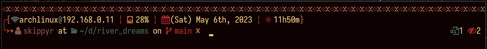
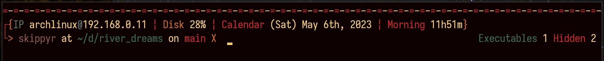

<h1>River Dreams</h1>
	<h2>Starting Point</h2>
	
A multi line theme for ZSH.

	
	
In the image, River Dreams was used on the <a href="https://github.com/kovidgoyal/kitty">Kitty</a> terminal emulator with the <a href="https://github.com/skippyr/flamerial">Flamerial</a> theme and <a href="https://github.com/be5invis/Iosevka">Iosevka</a> font.

	
Below, there are descriptions of what the prompt has to offer:

	
In the left prompt you will find:

	<ul>
		<li>A separator to isolate the prompt from the output of the last command.</li>
		<li>Your host name and local ipv4 address.</li>
		<li>The in-use percentage of your main disk.</li>
		<li>A calendar that shows the week day, month, day and year.</li>
		<li>A clock that shows the hour and minute.</li>
		<li>The exit code of your last command if it has failed.</li>
		<li>Your user name.</li>
		<li>The path of sourced virtual environment abbreviated if you are using <code>virtualenv</code>.</li>
		<li>Your current directory path abbreviated.</li>
		<li>The name of the branch if you are inside of a directory tracked by <code>git</code>.</li>
	</ul>
	
In the right prompt you will find:

	<ul>
		<li>The quantity of executables, hidden files and symbolic links in your current directory.</li>
		<li>The quantity of jobs running in the background for the current shell session.</li>
	</ul>
	
River Dreams also contains a fallback text feature, that allows you to use it even when not using a modern terminal emulator.

	
	<h2>Installation And Usage</h2>
		<h3>Dependencies And Recommendations</h3>
			
Before doing any installing step, we first need to talk about dependencies and recommendations to use River Dreams:

			<ul>
				<li>Install ZSH</li>
				
This is the shell this theme applies to.

				<li>Install <a href="https://www.rust-lang.org/">Rust development tools</a>.</li>
				
These are the compiler and tools needed to compile River Dreams's source code.

				<li>Install a font patched by the <a href="https://github.com/ryanoasis/nerd-fonts">Nerd Fonts</a> project and the <a href="https://fonts.google.com/noto/specimen/Noto+Sans">Noto Sans Font Family</a>.</li>
				<li>Install git</li>
				
Even that you do not really need it, git will ease the installation steps further in this document. So, you will not have to do it manually.

				
These fonts contains pretty symbols that are used in the prompt. It is highly recommend to use one to improve your experience, however, they are optional as you can run River Dreams with its fallback text feature.

				
Are you looking for a font recommendation? As River Dreams can take a lot of space in your screen, it turns out to be the perfect environment for you to test out narrow fonts like <a href="https://github.com/be5invis/Iosevka">Iosevka</a>. That font also contains a lot of <a href="https://github.com/be5invis/Iosevka/blob/main/doc/stylistic-sets.md">stylistics sets</a> that make it more likely other fonts: like Fira Mono and Pragmata Pro. You probably will like it.

				<li>Install a great terminal emulator, like <a href="https://github.com/kovidgoyal/kitty">Kitty</a>.</li>
				
Even that River Dreams and ZSH can run basically in any terminal emulator, using one that is fast and that can handle unicode characters really well will improve your experience.

			</ul>
			
After you have installed the dependencies, its time for you to choose how you want to install River Dreams: just by sourcing it or using a framework.

			
Below, there are some instructions to do some of those methods.

		<h3>Stand Alone Installation (recommended)</h3>
			
In this section, you will learn how to install River Dreams without using any frameworks or package managers for ZSH.

			<ul>
				<li>Download this repository to a directory in your machine.</li>
				
If you have <code>git</code> installed, you can download it in the following command:

				<pre><code>git clone --depth=1 https://github.com/skippyr/river_dreams ${HOME}/.config/zsh/themes/river_dreams</code></pre>
				
This command will clone this repository to the directory <code>${HOME}/.config/zsh/themes/river_dreams</code>, however fell free to change it in the example. Just remember the path you have used because you will need it for the next step. The flag <code>--depth</code> with value <code>1</code> specifies to <code>git</code> that you only want to download the last commit, instead of the whole commit tree as it does by default.

				
If you do not have <code>git</code> installed, do not worry, as you can also download the repository from GitHub. Just access the page of the project there, click on the <code>Code</code> button on the top of the page, then on <code>Download ZIP</code>. This will download a ZIP file, you just have to unzip it in the directory you want it to be.

				<li>Add a source rule in your ZSH configuration file: <code>${HOME}/.zshrc</code> to source the theme file <code>river_dreams.zsh-theme</code> that is in the root directory of the repository that you have just downloaded.</li>
				<pre><code>source ~/.config/zsh/themes/river_dreams/river_dreams.zsh-theme</code></pre>
				
If you have chosen other directory in the last step, just change it in the source command. Pay attention to use <code>/river_dreams.zsh-theme</code> in the end of the path to include the theme file instead of the directory itself.

				<li>Restart your ZSH session.</li>
				
At this point, the source code will be automatically compiled and, when it finishes, the prompt will be ready for you to use.

			</ul>
			
If you want to uninstall River Dreams, follow these steps:

			<ul>
				<li>Remove the repository that you have cloned.</li>
				<pre><code>rm -rf  ${HOME}/.config/zsh/themes/river_dreams</code></pre>
				
This command will remove the directory used in the examples. If you have used other directory, you will have to change it in the command when you use it.

				<li>Remove the source rule you have included in the <code>${HOME}/.zshrc</code> file.</li>
			</ul>
		<h3>Installing Using OhMyZSH</h3>
			
In this section, you will learn how to install River Dreams and make it work within the OhMyZSH framework.

			
For it to work, as expected, you must have installed <a href="https://github.com/ohmyzsh/ohmyzsh">OhMyZSH</a> first.

			<ul>
				<li>Download this repository to the directory where OhMyZSH looks for custom themes.</li>
				
If you have git installed, this command will do the trick:

				<pre><code>git clone --depth=1 https://github.com/skippyr/river_dreams ${ZSH_CUSTOM:-${HOME}/.oh-my-zsh/custom}/themes/river_dreams</code></pre>
				
This command will clone this repository to the required directory. The flag <code>--depth</code> with value <code>1</code> specifies to <code>git</code> that you only want to download the last commit, instead of the whole commit tree as it does by default.

				
If you do not have <code>git</code> installed, do not worry, as you can also download the repository from GitHub. Just access the page of the project there, click on the <code>Code</code> button on the top of the page, then on <code>Download ZIP</code>. This will download a ZIP file, you just have to unzip it the directory shown in the command.

				<li>Change the value of the variable <code>ZSH_THEME</code> in the <code>${HOME}/.zshrc</code> file to start River Dreams:</li>
				<pre><code>ZSH_THEME="river_dreams/river_dreams"</code></pre>
				<li>Restart your ZSH session.</li>
				
At this point, the source code will be automatically compiled and, when it finishes, the prompt will be ready for you to use.

			</ul>
			
If you want to uninstall River Dreams, follow these steps:

			<ul>
				<li>Remove the repository that you have cloned.</li>
				<pre><code>rm -rf ${ZSH_CUSTOM:-${HOME}/.oh-my-zsh/custom}/themes/river_dreams</code></pre>
				<li>Change the value of the variable <code>ZSH_THEME</code> in the <code>${HOME}/.zshrc</code> file for a valid theme from OhMyZSH. Its default value is:</li>
				<pre><code>ZSH_THEME="robbyrussell"</code></pre>
			</ul>
	<h2>Customization</h2>
		
River Dreams can be customized through the use of environment variables.

		<ul>
			<li><code>RIVER_DREAMS_USE_FALLBACK_TEXT</code></li>
			
This environment variable allow you to activate/deactivate the use of fallback text. This can be useful when you can not have access to a terminal font with pretty symbols:

			
Activate it by exporting it with value <code>1</code>.

			<pre><code>export RIVER_DREAMS_USE_FALLBACK_TEXT="1"</code></pre>
			
Deactivate it by exporting it with any other value like <code>0</code> for example.

			<pre><code>export RIVER_DREAMS_USE_FALLBACK_TEXT="0"</code></pre>
			
If you do not set it, River Dreams will automatically set it for your current shell session based in your terminal's color support: if your terminal only supports the 3-bits color palette (ansi values from 0 to 8), it will activate it by setting it with value <code>1</code>. If not, it will deactivate it with value <code>0</code>. I know that it sounds weird, but that is the only effective method that I have found to determinate if you are possibling using an old terminal or not.

			
This variable can make changes even when River Dreams is already running.

		</ul>
		
Further more, if you know Rust, you can change River Dreams's source code and make it be however you would like it to be. After making your changes, you can recompile the source again in your current ZSH session by using the function <code>river_dreams::compile</code>

		<pre><code>river_dreams::compile</code></pre>
	<h2>See Also</h2>
		
Thanks to <a href="https://github.com/unixorn">unixorn</a>, River Dreams is now available in the <a href="https://github.com/unixorn/awesome-zsh-plugins">awesome-zsh-plugins</a> repository. It hosts a lot of other cool ZSH themes, plugins, frameworks and more. So what about going there to see what else you like?

	<h2>Issues And Contributions</h2>
		
Learn how to report issues, questions and ideas and how to contribute to this project by reading its <a href="https://skippyr.github.io/materials/pages/contributions_guideline.html">contributions guideline</a>.

	<h2>License</h2>
		
River Dreams is released under the MIT License. You can refer to the license as the file <code><a href="https://github.com/skippyr/river_dreams/blob/main/LICENSE">LICENSE</a></code> in the root directory of this repository.

		
Copyright (c) 2023, Sherman Rofeman. MIT License.

