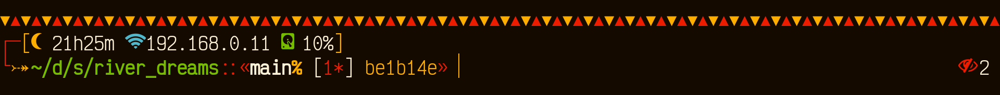
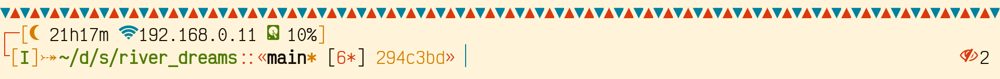
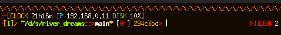

# River Dreams

An async ZSH theme that developers have been river dreaming for a long time.

## Preview

## More About

Learn everything you need about the River Dreams project in its [Wiki
page](https://github.com/skippyr/river_dreams/wiki).

## See Also

River Dreams is now part of the [`awesome-zsh-plugins`](https://github.com/unixorn/awesome-zsh-plugins)
repository. What about going there to find out more cool themes, frameworks and
plugins for ZSH?

Are you looking for a color scheme? I am proud to announce that
[`Tropical Paradise`](https://github.com/tropical-paradise) has been
released with dark and light variants. What about checking it out?

## Issues, Enhancements And Questions

If you have found an issue while using this software or have an idea to
improve it, feel free to use the issues tab on its page on GitHub.

Questions can be made in the same way, but it would be better if you use
the Discussions tab instead.

## License

Copyright (c) 2023, Sherman Rofeman. MIT License.

