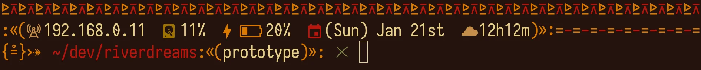

<p align="center">
	
</p>
<h1 align="center">⊼⊵⊼⊵&ensp;riverdreams&ensp;⊼⊵⊼⊵</h1>
<p align="center">
	
	&nbsp;
	
	&nbsp;
	
	&nbsp;
	
</p>

## ❡ About

A tribal inspired ZSH theme for Linux.

<p align="center"></p>
<p align="center"><sup><strong>Caption:</strong> a preview of the riverdreams theme applied on zsh. The terminal theme used is <a href="https://github.com/skippyr/flamerial">flamerial</a> and font is <a href="https://github.com/be5invis/Iosevka">iosevka SS08</a>.</sup></p>


### ¦ Features

Its left prompt displays:

&emsp;**1.**&ensp;Your local IPV4 address.\
&emsp;**2.**&ensp;Your disk use percentage.\
&emsp;**3.**&ensp;Your battery status and percentage, if any.\
&emsp;**4.**&ensp;A calendar.\
&emsp;**5.**&ensp;A clock.\
&emsp;**6.**&ensp;A decorator when you are the root user.\
&emsp;**7.**&ensp;A decorator for exit codes.\
&emsp;**8.**&ensp;The active virtual environment, if one has been sourced.\
&emsp;**9.**&ensp;The active directory path, shorting it when inside a git repo.\
&emsp;**10.**&ensp;The active branch, when inside of a git repo.\
&emsp;**11.**&ensp;A decorator to check if you can modify the active directory.

Its right prompt displays:

&emsp;**1.**&ensp;The total of hidden entries in the active directory.\
&emsp;**2.**&ensp;The total of temporary entries in the active directory.\
&emsp;**3.**&ensp;The total of symlinks in the active directory.\
&emsp;**4.**&ensp;The total of executables in the active directory.\
&emsp;**5.**&ensp;The total of background jobs.

## ❡ Install

### ¦ Dependencies

The following dependencies are required to install it:

&emsp;**1.**&ensp;**git**: it will be used to clone this repository.\
&emsp;**2.**&ensp;**gcc**, **make**: they will be used to compile and install it.\
&emsp;**3.**&ensp;**Nerd Fonts Symbols**, **Noto Sans**: these fonts provides the pretty symbols used in the prompt.

### ¦ Procedures

Using a terminal, follow these steps:

&emsp;**1.**&ensp;Clone this repository using git:

```sh
git clone https://github.com/skippyr/riverdreams;
```

&emsp;**2.**&ensp;Access the repository directory using cd:

```sh
cd riverdreams;
```

&emsp;**3.**&ensp;Use make to compile and install it:

```sh
sudo make install clean;
```

&emsp;**4.**&ensp;Apply the theme in your ~/.zshrc startup file.

```zsh
export VIRTUAL_ENV_DISABLE_PROMPT=1;

setopt promptsubst;
PROMPT='$(riverdreams_lprompt)';
RPROMPT='$(riverdreams_rprompt)';
```

&emsp;**5.**&ensp;Reopen ZSH.

## ❡ Uninstall

Using a terminal, follow these steps:

&emsp;**1.**&ensp;Go back to the repository directory.\
&emsp;**2.**&ensp;Use make to uninstall it:

```sh
sudo make uninstall;
```

## ❡ Help

If you need help about this project, open a new issue in its [issues page](https://github.com/skippyr/riverdreams/issues) or send me an [e-mail](mailto:skippyr.developer@gmail.com) describing what is going on.

## ❡ Contributing

This project is open to review and possibly accept contributions, specially fixes and suggestions. If you are interested, send your contribution to its [pull requests page](https://github.com/skippyr/riverdreams/pulls) or to my [e-mail](mailto:skippyr.developer@gmail.com).

By contributing to this project, you must agree to license your work under the same license that the project uses.

## ❡ License

This project is licensed under the MIT License. Refer to the LICENSE file that comes in its source code for license and copyright details.

&nbsp;

<p align="center"><sup><strong>⊼⊵⊼⊵&ensp;Here Are Dragons!&ensp;⊼⊵⊼⊵</strong><br />Made with love by skippyr <3</sup></p>
