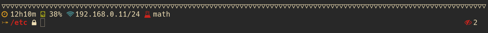
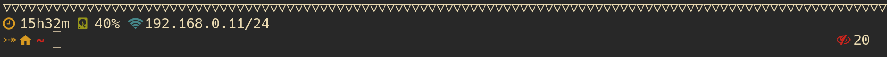

# River Dreams

## Preview

## Introduction

"River Dreams" is a prompt plugin for ZSH that shows useful information about
your current environment.

To learn how to install and understand how to use this plugin, please refer
to its [Wiki](https://github.com/skippyr/river_dreams/wiki).

## License

Copyright (c) 2023 Sherman Rofeman. MIT License.
