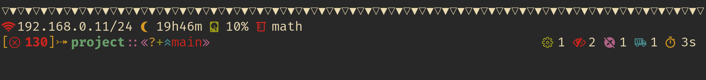

# River Dreams

The ZSH theme that developers have been dreaming for a long time. It will
finally show how you are the best terminal wizard out there while providing you
useful information about your development environment. Made with love, because
you deserve it.


## Preview




## What information does it shows?
  + local IP address.
  + current hours and minutes.
  + disk usage of the partition mounted at `/`.
  + sourced Python environment.
  + exit status on errors.
  + root decorator.
  + writting mode.
  + current directory with an icon if it is a home directory.
  + directory ownership decorator.
  + git branch and its status with numeric indicators and decorators and last commit hash.
  + hidden files quantity.
  + git ignored files quantity.
  + active Docker containers quantity.
  + quantity of jobs running in the background.
  + time elapsed in the last command in minutes and seconds.

## Installation/Uninstallation

Before installing the theme, you need to ensure that you have its required
dependencies installed:
  + the Noto Font family - this font has a variety of characters that can
    be used as a fallback by your terminal if your current font does not
    contains some symbols used in the theme.
  + a font patched by Nerd Fonts or only the Nerd Font symbols - this font will
    provide you the symbols used in the theme. You can download it in its
    official repository on GitHub.
  + `awk` or some variant - it will be used to parse commands.

Optionally, you can install these other dependencies to get more information
to show in the theme:
  + `git` - it will be used to provide Git information.
  + `docker` - it will be used to provide Docker information. Remember to
     activate its socket/daemon.
  + `ip` or `ipconfig` - it will be used to provide your local IP address.

If you are using Linux, you can probably download the dependencies using
your distribution's package manager.

If you are using MacOS, you can use [HomeBrew](https://brew.sh).

### Installing/Uninstalling With OhMyZSH
  + clone this repository to `${ZSH_CUSTOM}/themes` that is, by default, at
    `~/.oh-my-zsh/custom/themes`.

    ```bash
    git clone --depth 1 https://github.com/skippyr/river_dreams ${ZSH_CUSTOM:-~/.oh-my-zsh/custom}/themes/river_dreams
    ```
  + Set the variable `ZSH_THEME=river_dreams/river_dreams` in your `~/.zshrc`.
  + Refresh your ZSH by reopening your terminal emulator.

  If you want to uninstall it, use the following command:
  
  ```bash
  rm -rf ${ZSH_CUSTOM:-~/.oh-my-zsh/custom}/themes/river_dreams
  ```

### Installing/Uninstalling Manually
  + clone this repository to a separated directory, for example
    `~/.config/zsh/plugins/river_dreams`.

    ```bash
    git clone --depth 1 https://github.com/skippyr/river_dreams ~/.config/zsh/plugins/river_dreams
    ```
  + source the theme file `river_dreams.zsh-theme` that is inside the
    repository's directory in your `.zshrc`.

    ```bash
    source ~/.config/zsh/plugins/river_dreams/river_dreams.zsh-theme
    ```
  + Refresh your ZSH by reopening your terminal emulator.

  If you want to uninstall it, remove the directory you have cloned:

  ```bash
  rm -rf ~/.config/zsh/plugins/river_dreams
  ```

## See Also

River Dreams is now part of the [`awesome-zsh-plugins`](https://github.com/unixorn/awesome-zsh-plugins) repository. What about
going there to find out more cool themes, frameworks and plugins for ZSH?

Are you looking for a color scheme? I am proud to announce that [`Tropical Paradise`](https://github.com/skippyr/tropical_paradise) has been released with light and
dark variants. What about checking it out?

## License

Copyright (c) 2023 Sherman Rofeman. MIT License.
