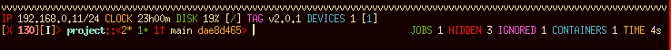
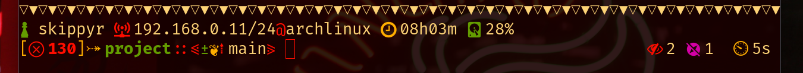
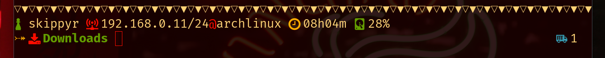
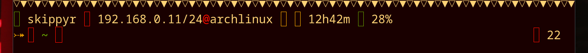
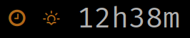
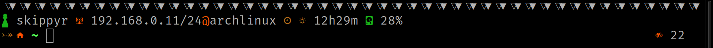
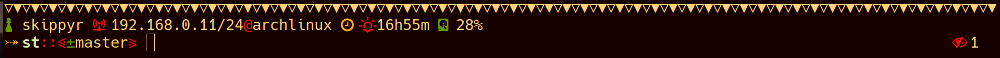

# River Dreams

The ZSH theme that you have been dreaming for a long time. It will do the work in showing how you are cool and nerd while providing you useful information about your environment.


## Preview








In these images:
  + the color scheme used is [`Tropical Paradise`](https://github.com/skippyr/tropical_paradise).
  + the font is [`Fira Code`](https://github.com/tonsky/FiraCode) with `Symbols Nerd Font Mono` as fallback.
  + the terminal emulator is `Kitty`.


## What information does it shows?
  + current user.
  + local IP address and host name.
  + current hours and minutes.
  + disk usage of the partition mounted at `/`.
  + sourced Python environment.
  + exit status on errors.
  + current directory with an icon if it is a home directory.
  + directory ownership.
  + git branch and its status.
  + hidden files quantity.
  + git ignored files quantity.
  + active Docker containers quantity.
  + quantity of jobs running in the background.
  + time elapsed in the last command in minutes and seconds.

## Installation

Before installing the theme, you need to ensure that you have its required
dependencies installed:
  + the Noto Font family - this font has a variety of characters that can
    be used as a fallback by your terminal if your current font does not
    contains some symbols used in the theme.
  + a font patched by Nerd Fonts or only the Nerd Font symbols - this font will
    provide you the symbols used in the theme. You can download it in its
    official repository on GitHub.
  + `awk` or some variant - it will be used to parse commands.

Optionally, you can install these other dependencies to get more information
to show in the theme:
  + `git` - it will be used to provide Git information.
  + `docker` - it will be used to provide Docker information. Remember to
     activate its socket/daemon.
  + `ip` or `ipconfig` - it will be used to provide your local IP address.

If you are using Linux, you can probably download the dependencies using
your distribution's package manager.

If you are using MacOS, you can use [HomeBrew](https://brew.sh).

### Installing To OhMyZSH
  + clone this repository to `${ZSH_CUSTOM}/themes` that is, by default, at
    `~/.oh-my-zsh/custom/themes`.

    ```bash
    git clone --depth 1 https://github.com/skippyr/river_dreams ${ZSH_CUSTOM:-~/.oh-my-zsh/custom}/themes/river_dreams
    ```
  + Set the variable `ZSH_THEME=river_dreams/river_dreams` in your `~/.zshrc`.
  + Refresh your ZSH by reopening your terminal emulator.

### Installing Manually
  + clone this repository to a separated directory, for example
    `~/.config/zsh/plugins/river_dreams`.

    ```bash
    git clone --depth 1 https://github.com/skippyr/river_dreams ~/.config/zsh/plugins/river_dreams
    ```
  + source the theme file `river_dreams.zsh` that is inside the repository's
    directory in your `.zshrc`.

    ```bash
    source ~/.config/zsh/plugins/river_dreams/river_dreams.zsh
    ```
  + Refresh your ZSH by reopening your terminal emulator.


## See Also

River Dreams is now part of the [`awesome-zsh-plugins`](https://github.com/unixorn/awesome-zsh-plugins) repository. What about
going there to find out more cool themes, frameworks and plugins for ZSH?


## Troubleshooting

This section will talk about common issues I have found when trying to apply River Dreams in some terminal emulators and how to solve them.


### Icons Not Showing



This is a font rendering issue the happens when your terminal can not
find the right fonts to use as fallback, normally the Nerd Font symbols.

To solve this issue, ensure that you install all the dependencies from
the `installation` section, specially the required fonts to be used as
a fallback.


### Icons Seems Small



This is a font rendering issue that happens when your terminal emulator is not
using the correct font containing the Nerd Fonts symbols as a fallback. It
usually happens when you have multiple fonts patched by Nerd Font installed and
it will use some of them as a fallback.

The solution for this issue is to either:
  + remove all the fonts patched by Nerd Font and only mantain the font
    contains its symbol, or
  + use a font patched by Nerd Font instead of using its symbols as a fallback.

If you are using Kitty, you can find out what fonts the terminal emulator is
using as a fallback in a session by executing it with a special flag:

```bash
kitty --debug-font-fallback
```


### Commands Separator Icon Seems Bugged



> This image shows the prompt in Konsole using Fira Code and Nerd Font symbols as a fallback.

This is a font rendering issue that happens in terminals that can not set the Nerd Fonts symbols as a fallback correctly for your current font, that is not
patched.

The solution for this issue is to use a font patched by Nerd Font instead of using its symbols as a fallback.


> This image shows the prompt in the same session of Konsole, but, now, using Hack Nerd Font, a font patched by Nerd Fonts.


## Bright Bold In St



This issue happens because `st`, by default, uses bright colors when rendering
bold text.

The solution for this issue is to use the patch [`bold is not bright`](https://st.suckless.org/patches/bold-is-not-bright).

## License

Copyright (c) 2023 Sherman Rofeman. MIT License.
