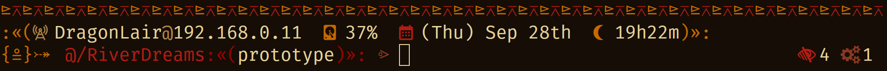
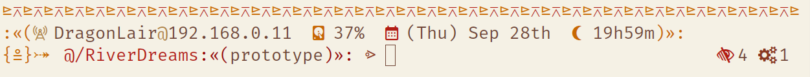

# River Dreams
## About It
This repository contains the source code of River Dreams, a tribal inspired theme for the ZSH shell.
It was designed to be a must-have tool in the tool-kit of any nerd out there, having a lot of
features to help you develop your dream projects.

Here are some previews that you can check it out:

> [!NOTE]
>
> This shell theme uses the terminal emulator's colors. This means that its colors may look
> different in your setup when compared to the preview.
>
> For same results, use the same theme: [Flamerial](https://github.com/skippyr/flamerial). The font used
> is Fira Mono (Nerd Font patched).




### Features
River Dreams is divided into two prompts: one on the left and other on the right.

In its left prompt, you will find:

-   Your host name and local IPV4 address. If a valid address is not found, it will use your
    loopback address: `127.0.0.1`. If you are connected to multiple networks, it will use the
    address of the first one that matches its required criterias:

    -   It contains an IPV4 address.
    -   It is running.
    -   It is not a loopback.

-   Your storage device usage percentage. It refers to the device that is mounted at `/`: your
    system's mount point.
-   A calendar displaying the day of the week, month and day of the month.
-   A clock displaying the hours and minutes of the day. Its symbol also changes depending on the
    moment of the day:

| Symbol    | Moment    | Hours                      |
| --------- | --------- | -------------------------  |
| Telescope | Dawn      | Between 00h00m and 06h00m. |
| Sun       | Morning   | Between 06h00m and 12h00m. |
| Cloud     | Afternoon | Between 12h00m and 18h00m. |
| Moon      | Night     | Between 18h00m and 00h00m. |

-   A decorator that alerts if you are the root user or not: it will show a hash symbol if you are.
-   A decorator that alerts if the last command executed failed or not: it will be a cross-like
    symbol if it has.
-   The name of sourced virtual environments.
-   The path of the directory you are currently in. It uses an alias for the home directory (`~`)
    and, if inside a Git repository, it will use a special alias (`@`) to short parent directories
    and only show the ones from inside that workspace.
-   If inside a Git repository, the name of the active branch.
-   A decorator that alerts about the current directory ownership: it will show a lock symbol if you
    are not the owner of the current directory, alerting that it is in a read-only state.

In the right prompt, you will find:

-   A status about the entries in your current directory:

    -   The total of hidden entries, represented by an eye symbol.
    -   The total of symlink entries, represented by a link symbol.
    -   The total of executable entries, represented by a play symbol (couting only includes regular
        files).

-   The total of jobs running in the background.

## Installation
### Dependencies
In order to install this software, the following dependencies must be installed:

-   `zsh`: this is the shell this theme applies on.
-   `git`: it will be used to clone this repository.
-   A font patched by the [Netd Fonts project](https://www.nerdfonts.com/font-downloads) and [Noto
    Sans](https://fonts.google.com/noto/specimen/Noto+Sans): they provide the pretty symbols used in
    the theme.
-   `make`, a C++ compiler (`g++` is recommended) and C POSIX headers: they will be used to compile
    the source code.

### Procedures
Using a command-line utility, follow these steps:

-   Clone this repository using `git`.

```bash
git clone --depth 1 https://github.com/skippyr/RiverDreams ~/.local/share/zsh/themes/RiverDreams
```

-   Access the repository's directory.

```
cd ~/.local/share/zsh/themes/RiverDreams
```

-   Compile the source code using `make`.

```bash
make
```

> [!IMPORTANT]
>
> By default, any compilation will use g++ as the compiler. However, if you want to use another, you
> can give it as an argument to make. For example, you can use clang++ instead:

```bash
make COMPILER=clang++
```

-   Add the following source rule in your `~/.zshrc` file to use the connector that will link the
    binaries compiled as your new prompt. Ensure to not source any other theme to avoid conflicts.

```bash
source ~/.local/share/zsh/themes/RiverDreams/Sources/ShellConnectors/ZSHConnector.zsh
```

-   Open a new ZSH session.

```bash
zsh
```

The theme should now be installed and running.

## Issues And Contributions
You can use its [issues page](https://github.com/skippyr/RiverDreams/issues) to provide your
feedback, to report any issue or to ask for help.

You can also fork it and send pull requests to be reviewed.

All kinds of contributions, from people of any skill level, is always appreciated.

## Copyright
This software is distributed under the MIT license. A copy of its license is bundled with the source
code as the file `LICENSE` in the root directory of this repository.

Copyright (c) 2023 Sherman Rofeman. MIT license.
