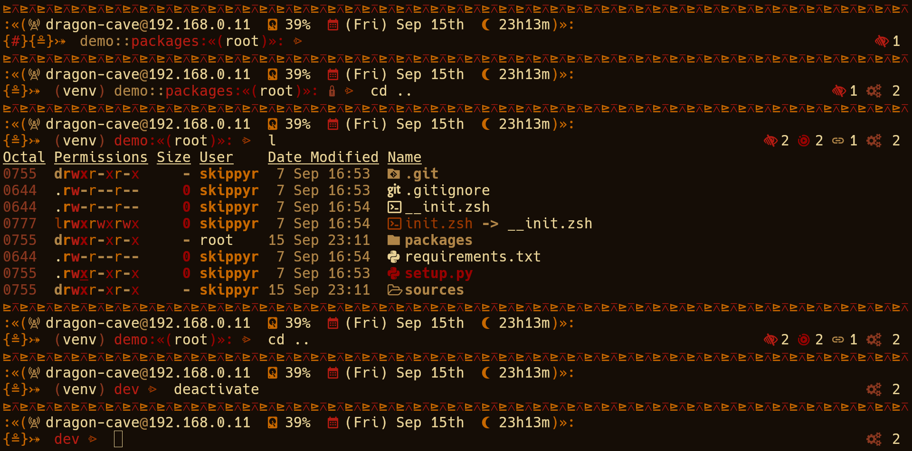

<p align="center">
  
</p>
<h1 align="center">≥v≥v&ensp;river-dreams&ensp;≥v≥v</h1>
<p align="center">
  
  &nbsp;
  
  &nbsp;
  
  &nbsp;
  
</p>

## ❡ About

A fast and full-featured tribal looking shell theme for Windows (PowerShell), Linux (ZSH) and MacOS (ZSH).

<p align="center">
  
</p>
<p align="center"><strong>Caption:</strong> <code>river-dreams</code> on MacOS.</p>

### Features

Its left prompt displays:

- Your local IPV4 address.
- If you have a battery, its charge and if it is charging.
- Your disk usage.
- A calendar.
- A 24 hours clock
- An indicator when you have administrator privileges.
- The exit code of the last command.
- The active Python virtual environment, if you have sourced one.
- The current active directory path, shorting it when inside of a `git` repository.
- The active branch, when inside of a `git` repository.

Its right prompt displays:

- The total of each entry type in the current active directory: block devices, character devices, directories, fifos, files, hidden entries, sockets, symlinks and temporary entries. Symlinks are also followed.

## ❡ Install

### Dependencies

The following dependencies must be installed before it:

#### Dependencies For Windows

- [**Visual Studio 2022**](https://visualstudio.microsoft.com) with the "Desktop development with C++" workload: it provides all the tools required to build this software.
- [**git**](https://git-scm.com): it will be used to clone this repository.
- **A font patched by the [Nerd Fonts project](https://www.nerdfonts.com/font-downloads)**: it provides the pretty symbols used by the software.

#### Dependencies For Linux

- **gcc**, **cmake**: they will be used to build this software.
- **git**: it will be used to clone this repository.
- **A font patched by the Nerd Fonts project**: it provides the pretty symbols used by the software.

> [!TIP]
> Use your distro package manager to install these packages.

#### Dependencies For MacOS

- **Apple Command Line Tools**, **cmake**: they will be used to build this software.
- **git**: it will be used to clone this repository.
- **A font patched by the Nerd Fonts project**: it provides the pretty symbols used by the software.

> [!TIP]
> Use `xcode-select --install` to install the Apple command line tools. For the rest, use [HomeBrew](https://brew.sh/).

### Procedures

On Windows, using the `Developer PowerShell for VS 2022` profile or, on any other operating systems, using any terminal, follow these instructions:

- Clone this repository using `git`:

```powershell
# For Windows (PowerShell).
git clone --depth 1 https://github.com/skippyr/river-dreams `
          "${env:USERPROFILE}\powershell\themes\river-dreams";
```

```zsh
# For Linux (ZSH) and MacOS (ZSH).
git clone --depth 1 https://github.com/skippyr/river-dreams \
          ~/.local/share/zsh/themes/river-dreams;
```

- Source the specific connector for your shell:

```powershell
# For Windows (PowerShell).
Write-Output `n'. "${env:USERPROFILE}\powershell\themes\river-dreams\src\connectors\river-dreams.ps1";' | `
Out-File -Append -Encoding UTF8 ${PROFILE};
```

```zsh
# For Linux (ZSH) and MacOS (ZSH).
echo "source ~/.local/share/zsh/themes/river-dreams/src/connectors/river-dreams.zsh;" >> ~/.zshrc;
```

- Reopen your shell.
- `river-dreams` should now be installed.

## ❡ Help

If you need help related to this project, open a new issue in its [issues pages](https://github.com/skippyr/river-dreams/issues) or send me an [e-mail](mailto:skippyr.developer@icloud.com) describing what is going on.

## ❡ Contributing

This project is open to review and possibly accept contributions, specially fixes and suggestions. If you are interested, send your contribution to its [pull requests page](https://github.com/skippyr/river-dreams/pulls) or to my [e-mail](mailto:skippyr.developer@icloud.com).

By contributing to this project, you agree to license your work under the same license that the project uses.

## ❡ License

This is free software licensed under the MIT License that comes WITH NO WARRANTY. Refer to the `LICENSE` file that comes in its source code for license and copyright details.

&ensp;
<p align="center"><sup><strong>≥v≥v&ensp;Here Be Dragons!&ensp;≥v≥</strong><br />Made with love by skippyr <3</sup></p>
