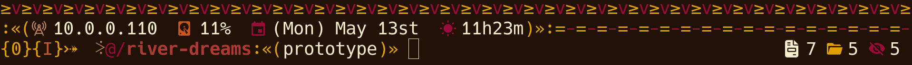
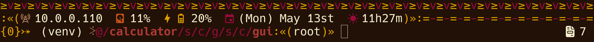
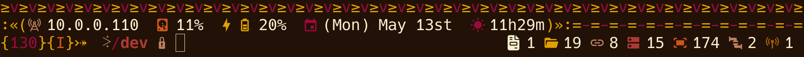
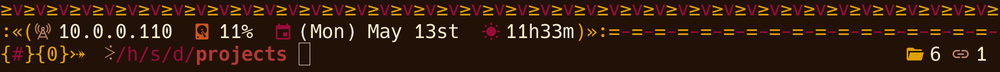

<div align="center">
    
</div>
<h1 align="center">≥v≥v&ensp;river-dreams&ensp;≥v≥v</h1>
<div align="center">
    
    &nbsp;
    
    &nbsp;
    
    &nbsp;
    
</div>

## ❡ About

A fast and full-featured tribal looking theme for the `zsh` shell for Linux.

<p align="center">
    
    
    
    
</p>
<p align="center"><sup><strong>Caption:</strong> River Dreams applied on <code>zsh</code> in different contexts. The terminal theme used is <a href="https://github.com/skippyr/flamerial">Flamerial</a> and font is <a href="https://www.nerdfonts.com/font-downloads">Hack</a> (Nerd Fonts patched).</sup></p>

### Features

Its left prompt displays:

- Your local IPV4 address or "No Address Found" in case no address is found.
- Your disk usage and a warning symbol if it is almost full.
- If you have a battery, its charge and a symbol to indicate its status: a warning symbol if is almost empty or a lightning one if it is charging.
- A calendar displaying the week day, month and day with its ordinal.
- A 24-hours clock with a symbol that changes depending on the day time: dawn, morning, afternoon and night.
- An indicator with a hastag symbol when you are the root user.
- The exit code of the last command you typed in.
- The active mode of the [zsh-vi-mode](https://github.com/jeffreytse/zsh-vi-mode) plugin if it has been sourced: normal (`N`), insert (`I`), visual (`V`) and replace (`R`).
- The active Python virtual environment if you have sourced one.
- The current working directory path, abbreviating parent directories and shorting it when inside of a `git` repository. The last path split and `git` repository names are always highlighted.
- The active branch, when inside of a `git` repository.
- A lock symbol when you do not have write access to the current working directory.

Its right prompt displays:

- The total of each entry type in your active directory: blocks, characters, directories, fifos, files, hidden entries, sockets, symlinks and temporary entries. Symlinks are also followed.
- The total of background jobs.

## ❡ Install

### Dependencies

The following dependencies must be installed before installing it:

- **git**: it will be used to clone this repository.
- **g++**, **make**: they will be used to compile this software.
- **Noto Sans**, [**Nerd Font Symbols**](https://www.nerdfonts.com/font-downloads): these fonts provide the pretty symbols used in the software.

### Procedures

#### Manual Procedures

If you want to install this software without a plugin manager or for a specific framework, using a terminal, follow these steps:

- Clone this repository using `git`:

```sh
git clone --depth 1 https://github.com/skippyr/river-dreams ~/.config/zsh/themes/river-dreams;
```

- Source the file `river-dreams.zsh-theme` that is inside of the repository you cloned in your `~/.zshrc` configuration file:

```sh
source ~/.config/zsh/themes/river-dreams/river-dreams.zsh-theme;
```

- Open a new `zsh` session.
- Wait for the theme to compile.

#### Procedures For OhMyZSH

If you want to install and use this software with the [`ohmyzsh`](https://github.com/ohmyzsh/ohmyzsh) framework, using a terminal, follow these steps:

- Clone this repository using `git`:

```sh
git clone --depth 1 https://github.com/skippyr/river-dreams                                        \
                    ${ZSH_CUSTOM:-~/.oh-my-zsh/custom}/themes/river-dreams;
```

- Apply the theme in your `~/.zshrc` configuration file by setting the `ZSH_THEME` variable:

```zsh
ZSH_THEME=river-dreams/river-dreams;
```

- Open a new `zsh` session.
- Wait for the theme to compile.

#### Procedures For Antidote

If you want to install this software with the [`antidote`](https://github.com/mattmc3/antidote) plugin manager, using a terminal, follow these steps:

- Add this repository to your plugins file, usually `~/.zsh_plugins.txt`.

```
skippyr/river-dreams
```

- Use `antidote` to load your plugins.

```sh
antidote load ~/.zsh_plugins.txt;
```

- Wait for the theme to compile.

## ❡ Help

If you need help related to this project, open a new issue in its [issues pages](https://github.com/skippyr/river-dreams/issues) or send me an [e-mail](mailto:skippyr.developer@gmail.com) describing what is going on.

## ❡ Contributing

This project is open to review and possibly accept contributions, specially fixes and suggestions. If you are interested, send your contribution to its [pull requests page](https://github.com/skippyr/river-dreams/pulls) or to my [e-mail](mailto:skippyr.developer@gmail.com).

By contributing to this project, you agree to license your work under the same license that the project uses.

## ❡ License

This is free software licensed under the MIT License that comes WITH NO WARRANTY. Refer to the `LICENSE` file that comes in its source code for license and copyright details.

&ensp;
<p align="center"><sup><strong>≥v≥v&ensp;Here Be Dragons!&ensp;≥v≥</strong><br />Made with love by skippyr <3</sup></p>
