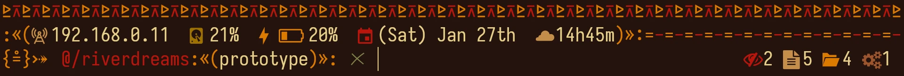

<p align="center">
	
</p>
<h1 align="center">≥v≥v&ensp;riverdreams&ensp;≥v≥v</h1>
<p align="center">
	
	&nbsp;
	
	&nbsp;
	
	&nbsp;
	
</p>

## ❡ About
A tribal inspired zsh theme for Linux designed to help you develop your dream projects.

<p align="center">
	
	<p align="center"><sup><strong>Caption:</strong> a preview showing riverdreams applied on zsh in its own repository. The terminal theme used is <a href="https://github.com/skippyr/flamerial">flamerial</a> and font is <a href="https://github.com/be5invis/Iosevka">iosevka</a>.</sup></p>
</p>

Its left prompt displays:

- Your local IPV4 address.
- Your disk use percentage.
- Your battery status and remaining charge, if any.
- A calendar.
- A clock.
- A decorator when you are the root user.
- A decorator for exit codes.
- Your active directory path, shorting it when inside of a git repo.
- The active branch, when inside of a git repo.
- A decorator when you can not modify the active directory.

Its right prompt displays:

- The total of each entry type in your active directory: files, directories, block devices, character devices, fifos, sockets and symlinks.
- The total of background jobs.

## ❡ Install

### Dependencies

In order to install it, the following dependencies must be installed:

- **git**: it will be used to clone this repository.
- **make**, **gcc**: they will be used to compile this theme.
- **Nerd Fonts Symbols**, **Noto Sans**: these fonts provide the pretty symbols used in the theme.

### Procedures

#### Manual Procedures

If you want to install it without a plugin manager or for a specific framework, follow these steps:

- Clone this repository using `git`:

```sh
git clone --depth 1 https://github.com/skippyr/riverdreams\
                    ~/.config/zsh/themes/riverdreams;
```

- Source the file `riverdreams.zsh-theme` that is inside of that repository in your `~/.zshrc` configuration file:

```zsh
source ~/.config/zsh/themes/riverdreams/riverdreams.zsh-theme;
```

- Reopen `zsh`.

#### Procedures For OhMyZSH

If you want to install and use it with the OhMyZSH framework, follow these steps:

- Clone this repository using `git`:

```sh
git clone --depth 1 https://github.com/skippyr/riverdreams\
                    ${ZSH_CUSTOM:-$HOME/.oh-my-zsh/custom}/themes/riverdreams;
```

- Apply the theme in your `~/.zshrc` configuration file:

```zsh
ZSH_THEME="riverdreams/riverdreams";
```

- Reopen `zsh`.

#### Procedures For Antidote

If you want to install it using the `antidote` package manager, follow these steps:

- Add this repository to your plugins file, usually `~/.zsh_plugins.txt`:

```
skippyr/riverdreams
```

- Use `antidote` to load your plugins:

```zsh
antidote load ~/.zsh_plugins.txt;
```

## ❡ Help

If you need help related to this project, open a new issue in its [issues pages](https://github.com/skippyr/riverdreams/issues) or send me an [e-mail](mailto:skippyr.developer@gmail.com) describing what is going on.

## ❡ Contributing

This project is open to review and possibly accept contributions, specially fixes and suggestions. If you are interested, send your contribution to its [pull requests page](https://github.com/skippyr/riverdreams/pulls) or to my [e-mail](mailto:skippyr.developer@gmail.com).

By contributing to this project, you agree to license your work under the same license that the project uses.

## ❡ License

This project is licensed under the MIT License. Refer to the `LICENSE` file that comes in its source code for license and copyright details.

&ensp;
<p align="center"><sup><strong>≥v≥v&ensp;Here Are Dragons!&ensp;≥v≥</strong><br />Made with love by skippyr <3</sup></p>