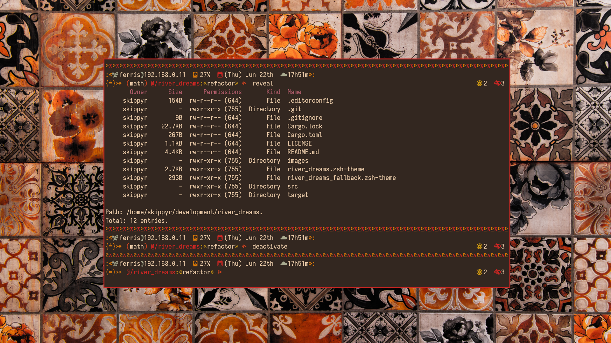

# River Dreams

## Starting Point

The River Dreams project is a theme for the ZSH shell inspired by tribal
patterns drawings. It is written in Rust, a compiled programming language, which
gives it an incredible performance and allows it to have multiple
functionalities.

This theme can be setup with a series of terminal emulators, themes and
wallpapers. You can use following preview as a source of inspiration and
reference to see what it can look like:



> In this preview, the River Dreams theme was used within the [Kitty terminal
  emulator](https://github.com/kovidgoyal/kitty) with the [Flamerial
  theme](https://github.com/skippyr/flamerial). Font used is
  [Iosevka](https://github.com/be5invis/Iosevka) (stylistic set `ss08`) with
  fallback to Nerd Fonts Symbols. Wallpaper is [A close up of a tiled
  wall with orange and black designs by Patrick Hendry](https://unsplash.com/photos/hezNrE5QEa8)
  from Unsplash.

## Features

This theme can show the following information:

* Your hostname and local IPV4 address
* The usage percentage of the disk mounted at `/`.
* A calendar that shows the week day, month and day.
* A clock in 24-hours format.
* A decorator that shows if you are the `root` user or not.
* The name of sourced virtual environments.
* Your current directory path abbreviated.
* If inside a Git repository, it shows the name of the branch.
* A lock decorator that appears whenever you are not the owner of the current
  directory.
* The quantity of executable files, hidden entries, symlinks and broken entries
  (like dangling symlinks) in your current directory.
* The quantity of jobs running in the background for the current shell
  session.

River Dreams also contains a fallback text feature that you can enable whenever
you need to work with a terminal emulator that can not render the pretty symbols
it uses by default.

## Dependencies

This theme has some dependencies that you need to download before installing it.

* git

    This is the terminal utility that will be used to download this project.

* The Rust Toolchain

    These are the set of tools used to compile the source code. You can find
    information on how to install it in the [Rust Lang website](https://www.rust-lang.org/).

* A font patched by the [Nerd Fonts project](https://github.com/ryanoasis/nerd-fonts)
  and [Noto Sans](https://fonts.google.com/noto/specimen/Noto+Sans) (optional).

    This font provides all pretty symbols used in this theme. If you do not
    install it, you can prefer to use its fallback text feature.

## Installation

You can install this theme in multiple ways, use the one that suits you best.

### Manually

* Run the following command to install the theme at
  `~/.local/share/zsh/themes/river_dreams`.

    ```bash
    git clone --depth=1 https://github.com/skippyr/river_dreams ~/.local/share/zsh/themes/river_dreams &&
    echo "source \"${HOME}/.local/share/zsh/themes/river_dreams/river_dreams.zsh-theme\"" >> ~/.zshrc
    ```

* Reopen your terminal emulator.
* Wait for the code to compile and start running the theme. This process can
  take some time, but you only need to do it once.

### Within OhMyZSH

* Install the theme in OhMyZSH custom themes' directory.

    ```bash
    git clone --depth=1 https://github.com/skippyr/river_dreams ${ZSH_CUSTOM:-${HOME}/.oh-my-zsh/custom}/themes/river_dreams
    ```

* Change the value of the `ZSH_THEME` variable in your ZSH configuration file,
  `~/.zshrc`, to use the theme.

    ```bash
    ZSH_THEME="river_dreams/river_dreams"
    ```

* Reopen your terminal emulator.
* Wait for the code to compile and start running the theme. This process can
  take some time, but you only need to do it once.

## Customization

### Fallback Text

You can toggle the fallback text feature by using the function:

```bash
river_dreams::toggle_fallback_text
```

If you want to make a persistent change to every shell session, you can prefer
to set the environment `RIVER_DREAMS_USE_FALLBACK_TEXT` with an integer value
that represents a boolean value:

* Set it with a `0` value to disable the feature.

```bash
export RIVER_DREAMS_USE_FALLBACK_TEXT="0"
```

* Set it with a `1` value to enable the feature.

```bash
export RIVER_DREAMS_USE_FALLBACK_TEXT="1"
```

If this environment variable is not set, River Dreams will automatically set
it based in your terminal emulator's color support, which, most of the times,
works perfectly fine to deduce your terminal can render pretty symbols or
not.

### Source Code

If you have decided to modify the source code, you can compile the source code
easily using the function:

```bash
river_dreams::compile
```

## Issues, Questions And Suggestions

Report issues,questions and suggestions through the [issues tab](https://github.com/skippyr/river_dreams/issues).

## License

This project is released under the terms of the MIT license. A copy of the
license is bundled with the source code.

Copyright (c) 2023, Sherman Rofeman. MIT license.

However, this project may depend on other open-source projects that may be under
different licenses. You can view its dependencies through its [dependency graph](https://github.com/skippyr/river_dreams/network/dependencies).
