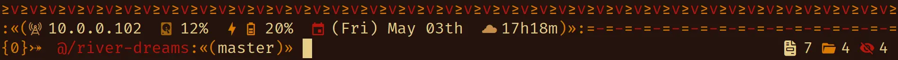

<p align="center">
  
</p>
<h1 align="center">≥v≥v&ensp;river-dreams&ensp;≥v≥v</h1>
<p align="center">
  
  &nbsp;
  
    &nbsp;
  
  &nbsp;
  
</p>

## ❡ About

A tribal inspired ZSH theme for Linux designed to help you develop your dream projects.

It includes many features that inform you about your environment, making it a great addition for any desktop setup, specially minimalist tiling window managers.

<p align="center">
  
</p>
<p align="center"><sup><strong>Caption:</strong> a preview of River Dreams applied on ZSH. The terminal theme used is <a href="https://github.com/skippyr/flamerial">Flamerial</a> and font is <a href="https://github.com/be5invis/Iosevka">Iosevka SS08</a>.</sup></p>

### Features

Its left prompt displays:

- Your local IPV4 address.
- Your disk usage.
- Your battery charge, if any.
- A calendar.
- A clock.
- A decorator when you are the root user.
- The exit code of the last command you typed in.
- The active Python virtual environment, if you have sourced one.
- The active directory path, shorting it when inside of a Git repository.
- The active branch, when inside of a Git repository.
- A decorator when you do not have access to the active directory.

Its right prompt displays:

- The total of each entry type in the active directory: regulars, directories, blocks, characters, sockets, fifos and symlinks.
- The total of background jobs.

## ❡ Install

### Dependencies

The following dependencies must be installed before installing it:

- **git**: it will be used to clone this repository.
- **gcc**, **make**: they will be used to compile this theme.
- [**Nerd Font Symbols**](https://www.nerdfonts.com/font-downloads), **Noto Sans**: they provide the pretty symbols used in the theme.

### Procedures

#### Manual Procedures

If you want to install this theme without a plugin manager or for a specific framework, follow these steps:

- Clone this repository using `git`:

```sh
git clone --depth 1 ~/.config/zsh/themes/river-dreams;
```

- Source the file `river-dreams.zsh-theme` that is inside of the repository you just cloned in your `~/.zshrc` configuration file:

```zsh
source ~/.config/zsh/themes/river-dreams/river-dreams.zsh-theme;
```

- Reopen `zsh`.

#### Procedures For OhMyZSH

If you want to install and use this theme with the [`ohmyzsh`](https://github.com/ohmyzsh/ohmyzsh) framework, follow these steps:

- Clone this repository using `git`:

```sh
git clone --depth 1 https://github.com/skippyr/river-dreams\
                    ${ZSH_CUSTOM:-$HOME/.oh-my-zsh/custom}/themes/river-dreams;
```

- Apply the theme in `~/.zshrc` configuration by setting the `ZSH_THEME` variable:

```zsh
ZSH_THEME="river-dreams/river-dreams";
```

- Reopen `zsh`.

#### Procedures For Antidote

If you want to install this theme with the [`antidote`](https://github.com/mattmc3/antidote) plugin manager, follow these steps:

- Add this repository to your plugins file, usually `~/.zsh_plugins.txt`.

```
skippyr/river-dreams
```

- Use `antidote` to load your plugins.

```zsh
antidote load ~/.zsh_plugins.txt;
```

## ❡ Help

If you need help related to this project, open a new issue in its [issues pages](https://github.com/skippyr/river-dreams/issues) or send me an [e-mail](mailto:skippyr.developer@gmail.com) describing what is going on.

## ❡ Contributing

This project is open to review and possibly accept contributions, specially fixes and suggestions. If you are interested, send your contribution to its [pull requests page](https://github.com/skippyr/river-dreams/pulls) or to my [e-mail](mailto:skippyr.developer@gmail.com).

By contributing to this project, you agree to license your work under the same license that the project uses.

## ❡ License

This project is licensed under the MIT License. Refer to the `LICENSE` file that comes in its source code for license and copyright details.

&ensp;
<p align="center"><sup><strong>≥v≥v&ensp;Here Are Dragons!&ensp;≥v≥</strong><br />Made with love by skippyr <3</sup></p>
