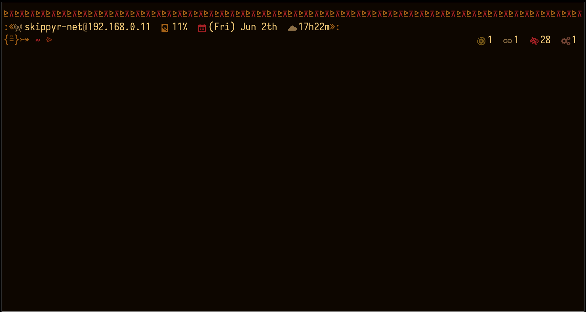
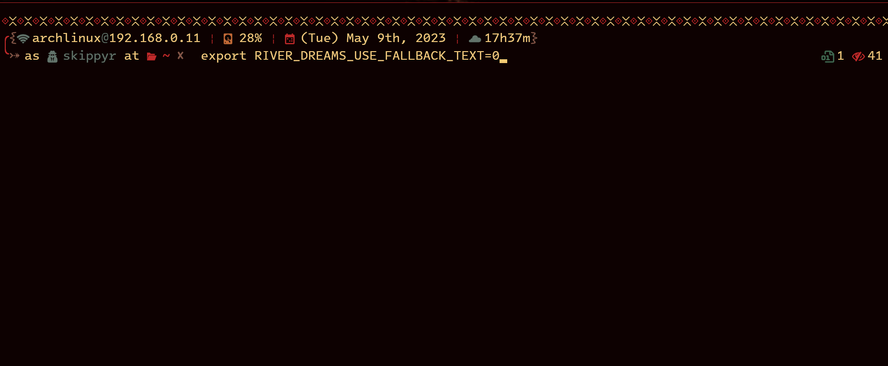

<h1>River Dreams</h1>
	
A tribal inspired ZSH theme that includes a fallback text feature.

	
	
	
In both previews, River Dreams was used on the <a href="https://github.com/kovidgoyal/kitty">Kitty</a> terminal emulator, with the <a href="https://github.com/skippyr/flamerial">Flamerial</a> theme and <a href="https://github.com/be5invis/Iosevka">Iosevka</a> font. Program used to list directory entries is <a href="https://github.com/skippyr/reveal">reveal</a>.

	
In its left prompt you will find:

	<ul>
		<li>Your local IPV4 address.</li>
		<li>The usage percentage of your disk.</li>
		<li>A calendar that shows week day, month and day.</li>
		<li>A clock that shows the hour and minute in 24 hours format.</li>
		<li>A hash decorator to show if you are root or not.</li>
		<li>The name of sourced virtual environments.</li>
		<li>Your current directory path abbreviated.</li>
		<li>The name of the branch if you are inside a <code>git</code> repository.</li>
		<li>A lock decorator if you are not the user owner of the current directory.</li>
	</ul>
	
In its right prompt, you will find:

	<ul>
		<li>The quantity of executable files, hidden entries, symlinks and broken entries (like dangling symlinks) in your current directory.</li>
		<li>The quantity of jobs running in the background for the current shell session.</li>
	</ul>
	<h2>Installation And Usage</h2>
		
There are some dependencies you need to install before installing River Dreams:

		<ul>
			<li>Rust.</li>
				
These are the tools to compile the source code. You can find more information in the <a href="https://www.rust-lang.org/">official website</a>.

			<li>A font patched by the Nerd Fonts project and the Noto Family.</li>
				
These are the fonts that will give you access to the symbols used in the theme. Without them, you still can prefer to use River Dreams with its fallback feature.

				
You can download Nerd Font from their <a href="https://github.com/ryanoasis/nerd-fonts/releases">releases page</a> on GitHub.

				
The Noto Family can be downloaded from <a href="https://fonts.google.com/noto">Google Fonts</a>, but you might also find it in package managers for Linux too. Usually it come pre installed in operating systems.

			<li>Git.</li>
				
This tool will be used to download this repository.

		</ul>
		
After installing the dependencies, choose one of the following ways to install River Dreams:

		<h3>Stand Alone Installation (recommended)</h3>
			<ul>
				<li>Clone this repository.</li>
					<pre><code>git clone https://github.com/skippyr/river_dreams ~/.config/zsh/themes/river_dreams</code></pre>
				<li>Add a source rule in the file <code>~/.zshrc</code> to include the theme file <code>river_dreams.zsh-theme</code> that is inside the repository cloned.</li>
					<pre><code>source ~/.config/zsh/themes/river_dreams/river_dreams.zsh-theme</code></pre>
				<li>Restart your ZSH session.</li>
				<li>Wait for the code to compile and the theme to start running.</li>
			</ul>
			To uninstall it:
			<ul>
				<li>Remove the repository cloned.</li>
					<pre><code>rm -rf ~/.config/zsh/themes/river_dreams</code></pre>
				<li>Remove the source rule used in the file <code>~/.zshrc</code>.</li>
			</ul>
		<h3>Installation Within OhMyZSH</h3>
			<ul>
				<li>Install OhMyZSH.</li>
					
You can find more information about it in its <a href="https://github.com/ohmyzsh/ohmyzsh">page on GitHub</a>.

				<li>Clone this repository to OhMyZSH custom themes's directory.</li>
					<pre><code>git clone --depth=1 https://github.com/skippyr/river_dreams ${ZSH_CUSTOM:-${HOME}/.oh-my-zsh/custom}/themes/river_dreams</code></pre>
				<li>Change the value of the variable <code>ZSH_THEME</code> in the file <code>~/.zshrc</code>.</li>
					<pre><code>ZSH_THEME="river_dreams/river_dreams"</code></pre>
			</ul>
			To uninstall it:
			<ul>
				<li>Remove the repository clone.</li>
					<pre><code>rm -rf ${ZSH_CUSTOM:-${HOME}/.oh-my-zsh/custom}/themes/river_dreams</code></pre>
				<li>Change the value of the variable <code>ZSH_THEME</code> in the file <code>~/.zshrc</code> to a valid ZSH theme.</li>
					<pre><code>ZSH_THEME="robbyrussell"</code></pre>
			</ul>
	<h2>Customization</h2>
		
You can enable the fallback feature of River Dreams by using an environment variable called <code>RIVER_DREAMS_USE_FALLBACK_TEXT</code>. That variable expects an integer value that represents a boolean:

		<ul>
			<li><code>0</code> means <code>false</code>, which will deativate the feature.</li>
			<pre><code>export RIVER_DREAMS_USE_FALLBACK_TEXT="0"</code></pre>
			<li><code>1</code> means <code>true</code>, which will enable the feature.</li>
			<pre><code>export RIVER_DREAMS_USE_FALLBACK_TEXT="1"</code></pre>
		</ul>
		
If not set, River Dreams will automatically set it a value based on your terminal emulator's color support.

		
Further more, River Dreams does not offers another user-friendly way of changing its look. If you need to tweak it, you will need to change its source code, then recompile it again. If that is your case, the shell script that you source to start it exposes a function to compile the code easily, which you can use:

		<pre><code>river_dreams::compile</code></pre>
	<h2>See Also</h2>
			
Thanks to <a href="https://github.com/unixorn">unixorn</a>, River Dreams is now available in the <a href="https://github.com/unixorn/awesome-zsh-plugins">awesome-zsh-plugins</a> repository. It hosts a lot of other cool ZSH themes, plugins, frameworks and more. So what about going there to see what else you like?

		<h2>Issues And Contributions</h2>
			
Learn how to report issues, questions and ideas and how to contribute to this project by reading its <a href="https://skippyr.github.io/materials/pages/contributions_guideline.html">contributions guideline</a>.

		<h2>License</h2>
			
River Dreams is released under the terms of the MIT License. You can refer to the license as the file <code><a href="https://github.com/skippyr/river_dreams/blob/main/LICENSE">LICENSE</a></code> in the root directory of this repository.

			
Copyright (c) 2023, Sherman Rofeman. MIT License.

