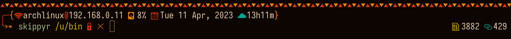
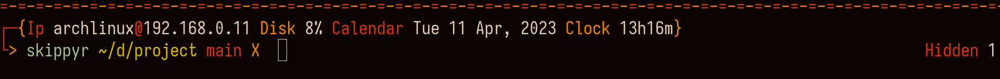

# River Dreams

## Introduction

River Dreams is a fast multi line ZSH theme written mostly in C, specially designed for programmers and hackers.






> In the images, River Dreams was used on the [Kitty](https://github.com/kovidgoyal/kitty) terminal with the [Flamerial](https://github.com/skippyr/flamerial) color schemes and [Iosevka](https://github.com/be5invis/Iosevka) ([stylistic set `ss08`](https://github.com/be5invis/Iosevka/blob/main/doc/stylistic-sets.md)) font. Noto Fonts and Symbols Nerd Font were used as fallback fonts.

The philosophy behind River Dreams is to create a comfortable and professional environment for people that want to spend most of their time in the terminal, by grouping most of the information that you would normally find in a system's bar in it.

Like this, it reduces your need of a graphical environment and becomes a great addition for when you are using a window manager or can not have access to your graphical environment, like when doing a maintenance.

In your prompt, you will find:

+ your local IPv4 address and your host name in the network.
+ the total disk usage percentage.
+ the current week day abbreviated, day of month, month abbreviated and year.
+ the current hours and minutes in 24h format.
+ the exit code of failed commands.
+ your current user.
+ the sourced Python virtual environment base name.
+ your current directory path abbreviated just like the `fish` shell does.
+ a decorator if you are not the user owner of the current directory.
+ the current git branch if you are in a directory being tracked by `git`.
+ a decorator to help you find where you can type your commands.
+ the quantity of background jobs.
+ the quantity of hidden files in the current directory.
+ the quantity of executable files in the current directory.
+ the quantity of symbolic links in the current directory.

River Dreams also contains fallback text, that can be used when you do not have access to a font that has the pretty symbols it uses. Learn how to enable and disable it in the Customization section.

## Installation

This section will teach everything you need to know to install River Dreams.

+ Install these dependencies:
	+ `ZSH`. This is the shell this theme applies on.
	+ `gcc` and standard C libraries. These are the compiler and libraries needed to compile the source codes. They will be probably already installed in your system.
	+ [`Noto Sans`](https://fonts.google.com/noto/specimen/Noto+Sans) and a font patched by [`Nerd Fonts`](https://github.com/ryanoasis/nerd-fonts). Those fonts provides the pretty symbols that are shown in the prompt. If you do want to install them, you can prefer to use River Dreams's fallback text. Normally, Noto Sans comes preinstalled in most systems.

	Most dependencies can be installed through package managers. If you are using Linux, refer to your distributions's package manager. If you are using MacOS, refer to [`HomeBrew`](https://brew.sh). Other dependencies can be installed from their specific websites. Hyperlinks are available in the topics above.
+ Download this repository to a directory in your machine. If you have `git` installed, you can use it in the following command:

	```bash
	git clone --depth 1 https://github.com/skippyr/river_dreams ~/.config/zsh/themes/river_dreams
	```

	This command will clone this repository to the directory `~/.config/zsh/themes/river_dreams`, but feel free to change to whatever directory you want to, just remember its path because you will need it for the next step. The flag `--depth` with value `1` specifies to `git` that you only want to download the latest commit, instead of the whole commit tree.

	If you do not have `git` installed, you can refer to the page of this project on GitHub and download it from there. Click in the `Code` button on the top of the page, then `Download ZIP`. This will download a ZIP file with the repository, you just have to unzip it.
+ Write a source rule in your ZSH configuration, `~/.zshrc`, to include the theme file `river_dreams.zsh-theme` that is in the root directory of the repository that you have downloaded.

	```bash
	source ~/.config/zsh/themes/river_dreams/river_dreams.zsh-theme
	```

	If you have used the directory recommended in previous step when downloading the repository, this is the rule to used. If not, just substitute it with the directory you have chosen instead and ensure to add `/river_dreams.zsh-theme` in the end to source the theme file instead of the directory.
+ Restart your ZSH session if you are running it and you finished the installation.

River Dreams is prepared to automatically compile the source codes once you source it, so it will just start running after it has done it.

## Customization

Without coding, River Dreams is customizable through the use of environment variables. When defining boolean values, use C standard: `0` means false and `1` means true.

Set the environment variable `RIVER_DREAMS_USE_FALLBACK_TEXT` to enable or disable the use of fallback text. If you do not set it, River Dreams will automatically set it based on your terminal capability of showing colors: if your terminal can only render the 4-bits color palette (ANSI values from `0` to `15`), it will set it with value `1`, and `0` if not. As there is no way to determinate precisely if your terminal can render pretty symbols, this is the best approach found to automatically set fallback text.

Further more, you can change what River Dreams does and how it looks by customizing the source codes itself.

## Issues, Questions And Ideas

If you had an issue, has a question or has an idea to improve River Dreams, feel free to use the Issues tab on its page on GitHub, so I can help you and see what you come with.

## Contributing

Contributions are welcome to fix issues and to answer questions reported in the Issues tab.

If you want to implement your own version of River Dreams, I would highly appreciate if you do it in a fork. Just remember to include credits to the original work and its original license.

## See Also

Thanks to [unixorn](https://github.com/unixorn), River Dreams is now available in the [awesome-zsh-plugins](https://github.com/unixorn/awesome-zsh-plugins) repository. It hosts a lot of other cool ZSH themes, plugins, frameworks and more. So what about going there to see what else you like?

## License

River Dreams is released under the MIT License. You can refer to the license as the file [`LICENSE`](https://github.com/skippyr/river_dreams/blob/main/LICENSE) in the root directory of this repository.

Copyright (c) 2023, Sherman Rofeman. MIT License.

