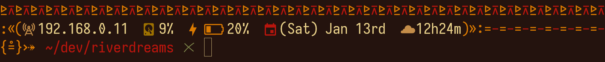

# River Dreams
A tribal-inspired ZSH theme for linux.



It displays:

- Your local IPv4 address.
- Your disk usage.
- Your battery percentage.
- A calendar.
- A clock.
- A decorator for root user.
- A decorator for exit codes.

## Requirements
In order to build it, you will need:

- A C90 compiler.
- The Noto Sans font.
- A font patched by the Nerd Fonts project (release `>= 3.0.0`).

## Installation
- Compile the file `river-dreams.c`.

```bash
mkdir -p ~/.local/bin/river-dreams
cc -std=c90 -O3 -o ~/.local/bin/river-dreams river-dreams.c
```

- Set it as your prompt in your `~/.zshrc` file.

```zsh
setopt prompsubst
PROMPT='$(~/.local/bin/river-dreams)'
```

- Reopen ZSH.

## Copyright
See LICENSE for copyright and license details.
